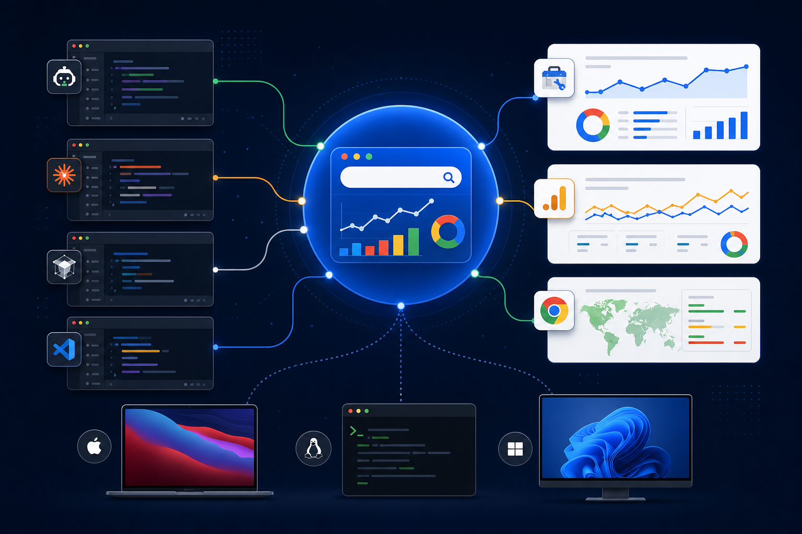

# SEO Google Suite MCP



Local plugin Compatible for Google Search Console, Google Analytics 4, and CrUX SEO workflows, compatible with Codex, Claude Code, Cursor, and VS Code through standard MCP configurations. See [editor compatibility](docs/COMPATIBILITY.md). 

Documentation: [Installation](docs/INSTALLATION.md) · [Credentials](docs/GOOGLE_AUTH.md) · [English credentials](docs/GOOGLE_AUTH.en.md) · [Editor compatibility](docs/COMPATIBILITY.md)

Maintained by Bernard GRENAT for [Powehi](https://powehi.eu). Source and project updates: [github.com/powehi-ai](https://github.com/powehi-ai).

Documentation: [français](docs/GOOGLE_AUTH.md) · [English](docs/GOOGLE_AUTH.en.md)

This plugin packages:

- Google Search Console MCP via `ncosentino/google-search-console-mcp`
- Google Analytics MCP via `googleanalytics/google-analytics-mcp`
- CrUX helper script using the public Chrome UX Report API

### Google authorization model

- **GSC MCP:** service-account JSON + Search Console property permission; enable the Search Console API. OAuth scopes are not required for the default local GSC path.
- **GA4 MCP:** OAuth JSON + `GOOGLE_PROJECT_ID`; add `https://www.googleapis.com/auth/analytics.readonly` for user OAuth access.
- **CrUX helper:** public requests may work without credentials; set `CRUX_API_KEY` for quota-managed access.

See [Google authorization](docs/GOOGLE_AUTH.md) for the exact scopes and setup order.

## Credits and upstream attribution

SEO Google Suite is maintained by Powehi. It is an integration and packaging layer and is not the author of the upstream MCP servers.

- Search Console MCP: [ncosentino/google-search-console-mcp](https://github.com/ncosentino/google-search-console-mcp), by Nicolas Cosentino. Used as the community GSC MCP implementation.
- Google Analytics MCP: [googleanalytics/google-analytics-mcp](https://github.com/googleanalytics/google-analytics-mcp), maintained under the Google Analytics GitHub organization. Used as the GA4 MCP implementation.
- CrUX: [Chrome UX Report API](https://developer.chrome.com/docs/crux/api/) and official Google documentation. The small helper in this plugin calls the public API.

Please consult each upstream repository for its own license, notices, and contribution history. Their names, code, and trademarks remain with their respective authors and maintainers. This repository only adds the Codex packaging, local setup scripts, documentation, and SEO workflow skill.

Runtime dependencies are installed in a user-local MCP directory. GA4 uses a dedicated virtual environment named `seo-google-suite-ga4-venv` to avoid version conflicts with other Google Python tooling. Windows uses `%USERPROFILE%`; macOS/Linux use `$HOME` and place command shims in `$HOME/.local/bin`.

Credentials are never bundled. Keep them under:

- `%USERPROFILE%\\.codex\\secrets\\google\\gsc-service-account.json`
- `%USERPROFILE%\\.codex\\secrets\\google\\ga4-credentials.json`

On macOS/Linux, the equivalent location is `$HOME/.codex/secrets/google/`.

## Quick Start

From Codex, ask: `Configure SEO Google Suite credentials`.
The plugin's setup flow asks for the local JSON file paths and GA4 property/project IDs, copies the files into the protected Codex secrets directory, and never asks you to paste private keys into chat.

```powershell
.\scripts\install-gsc.ps1
.\scripts\install-ga4.ps1
.\scripts\check-auth.ps1
```

macOS/Linux:

```bash
chmod +x scripts/*.sh
./scripts/install-gsc.sh
./scripts/install-ga4.sh
./scripts/check-auth.sh
```

Then restart Codex so the plugin MCP servers can be loaded.

For Claude Code, Cursor, and VS Code, export the credential variables in the
same shell that launches the editor; the MCP commands must be available on
`PATH` (the POSIX installers place them in `$HOME/.local/bin`).

Codex plugins currently expose authentication timing in the marketplace, but do not provide a custom arbitrary secret-form schema. The conversational setup skill is therefore the plugin interface for these Google-specific fields.

## Repository layout

| Path | Purpose |
| --- | --- |
| `.codex-plugin/plugin.json` | Codex plugin metadata |
| `.mcp.json` | Codex / Claude Code MCP configuration |
| `.cursor/mcp.json` | Cursor MCP template |
| `.vscode/mcp.json` | VS Code MCP template |
| `scripts/` | Installation, credential setup, and CrUX helper |
| `skills/` | Codex credential and SEO audit workflows |
| `docs/` | Installation, authorization, compatibility, and credits |

## Google Console Links

- GSC service account: https://console.cloud.google.com/iam-admin/serviceaccounts
- GSC users: https://search.google.com/search-console/users
- GA4 Data API: https://console.cloud.google.com/apis/library/analyticsdata.googleapis.com
- GA4 Admin API: https://console.cloud.google.com/apis/library/analyticsadmin.googleapis.com
- OAuth client JSON: https://console.cloud.google.com/apis/credentials/oauthclient
- CrUX API: https://console.cloud.google.com/apis/library/chromeuxreport.googleapis.com

## Notes

This is not an official Google MCP plugin. It is a local Codex plugin that wraps community and experimental MCP projects plus a small CrUX helper.

## Project links

- Website: [powehi.eu](https://powehi.eu)
- Repository: [github.com/bgrenat/google-suite-seo-mcp](https://github.com/bgrenat/google-suite-seo-mcp)
- Release: [v0.1.2](https://github.com/powehi-eu/google-suite-seo-mcp/releases/tag/v0.1.2)
